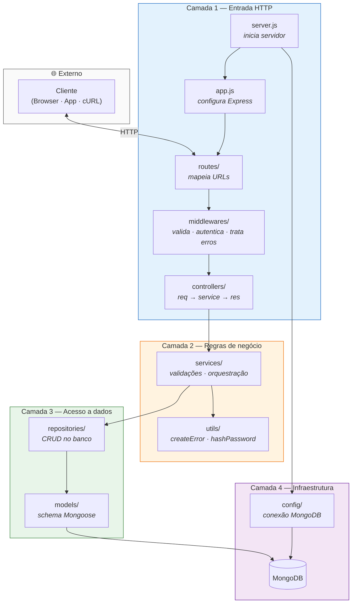
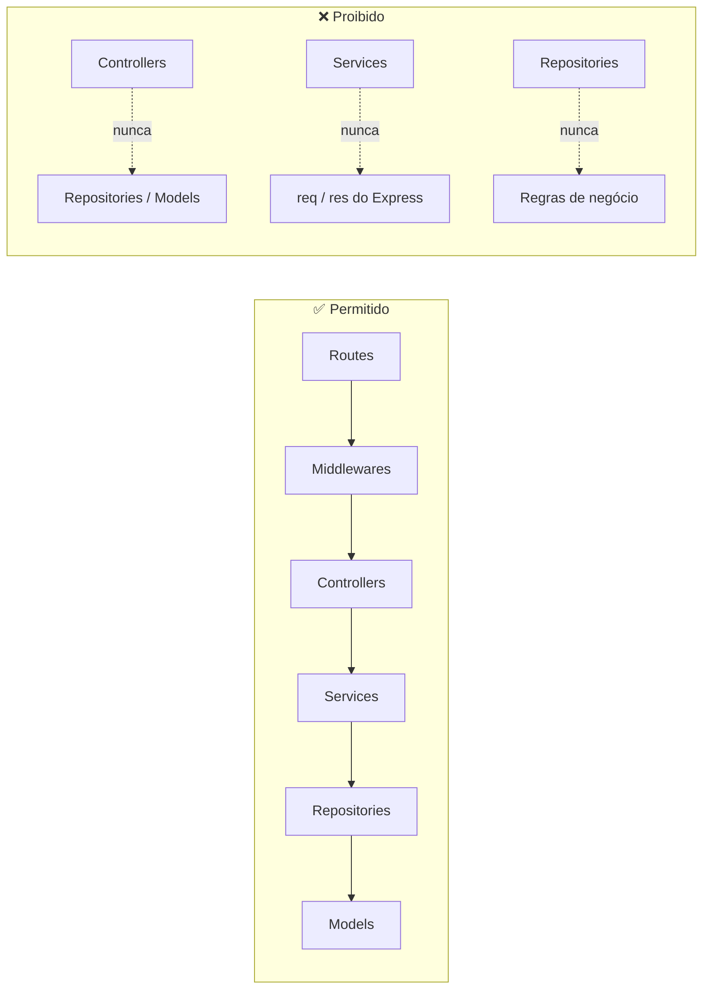
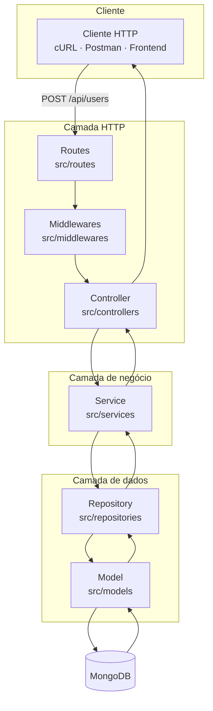
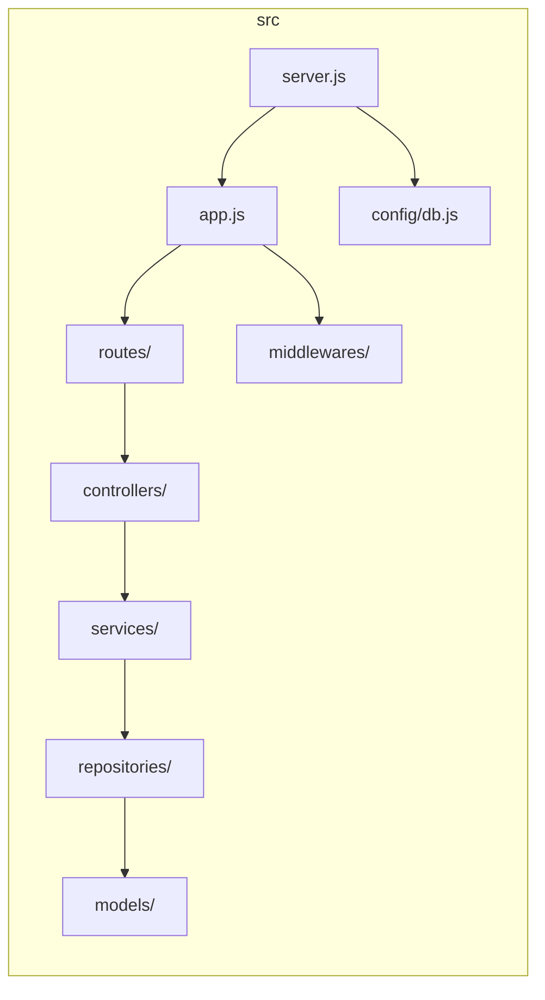
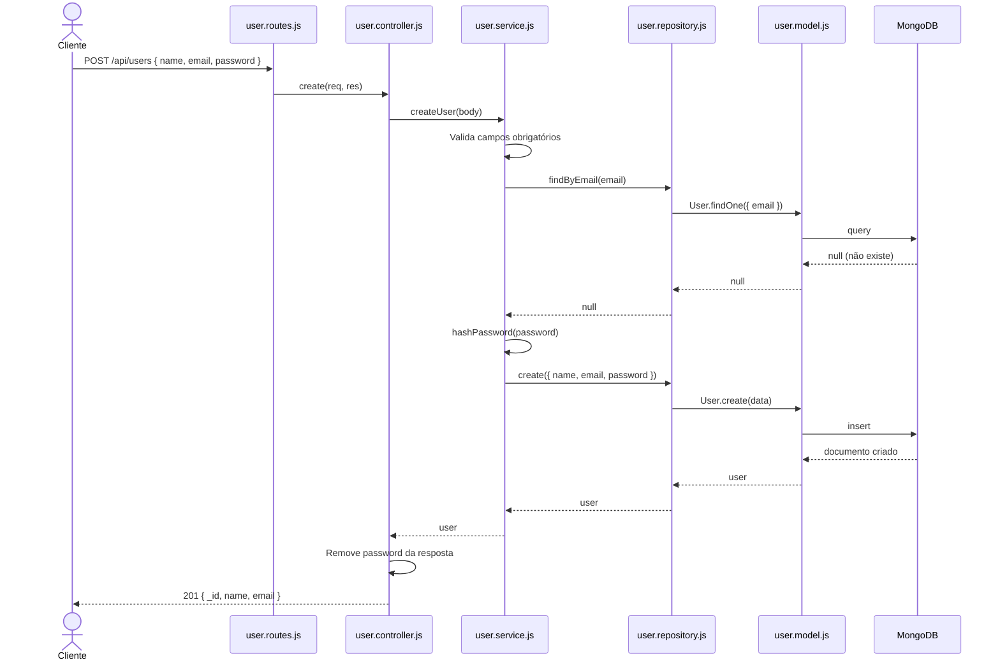
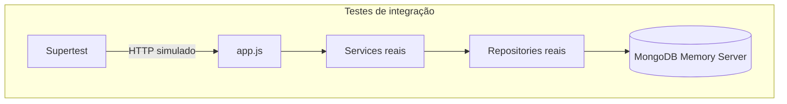
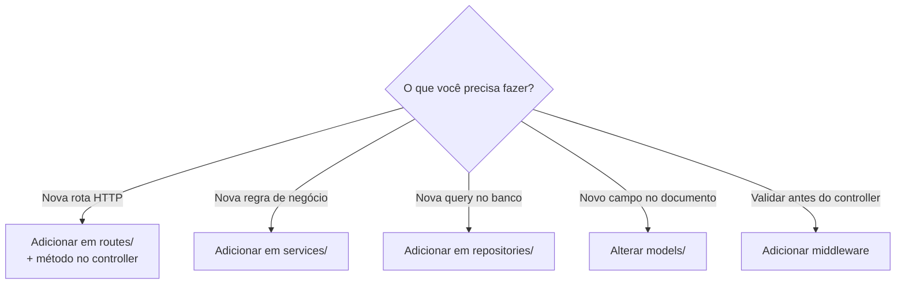

# Boilerplate Lions — API Node.js em Camadas

Boilerplate de referência para APIs REST com **Node.js + Express + MongoDB**, organizado em camadas (MVC + Service + Repository). O objetivo é servir como guia didático: cada pasta tem uma responsabilidade clara e o fluxo de uma requisição é previsível do início ao fim.

> **Stack:** Node.js · Express · Mongoose · bcryptjs · JWT · Jest  
> **Recursos:** CRUD de usuários, hash de senha, validações, middlewares e testes de integração

---

## Sumário

- [Diagrama das camadas](#-diagrama-das-camadas)
- [Visão geral da arquitetura](#-visão-geral-da-arquitetura)
- [Estrutura de pastas](#-estrutura-de-pastas)
- [Responsabilidades por camada](#-responsabilidades-por-camada)
- [Fluxo de uma requisição](#-fluxo-de-uma-requisição)
- [Tratamento de erros](#-tratamento-de-erros)
- [Começando rápido](#-começando-rápido)
- [Endpoints da API](#-endpoints-da-api)
- [Testes](#-testes)
- [Conceitos-chave para iniciantes](#-conceitos-chave-para-iniciantes)

---

## 📊 Diagrama das camadas

A API é organizada em **camadas empilhadas**. Cada camada só conversa com a camada **imediatamente abaixo** — nunca pula etapas (ex.: controller não chama repository diretamente).



### Regras de dependência entre camadas



### Mapa camada → pasta → arquivo

| Camada | Pasta | Arquivo de exemplo | Responsabilidade |
| :---: | :--- | :--- | :--- |
| **Entrada** | `src/routes/` | `user.routes.js` | Define `GET/POST/PUT/DELETE` |
| **Entrada** | `src/middlewares/` | `validate.middleware.js` | Valida ID, auth JWT, erros |
| **Entrada** | `src/controllers/` | `user.controller.js` | Traduz HTTP ↔ service |
| **Negócio** | `src/services/` | `user.service.js` | Regras: e-mail duplicado, hash |
| **Negócio** | `src/utils/` | `hash-password.js` | Funções auxiliares puras |
| **Dados** | `src/repositories/` | `user.repository.js` | `find`, `create`, `update`, `delete` |
| **Dados** | `src/models/` | `user.model.js` | Schema: campos e constraints |
| **Infra** | `src/config/` | `db.js` | Conexão com MongoDB |

---

## 🏗 Visão geral da arquitetura

A aplicação separa **quem recebe a requisição** (rotas/controller) de **quem decide o que fazer** (service) e **quem acessa o banco** (repository). Isso evita que regras de negócio fiquem espalhadas e facilita testes.



**Regra de ouro:** o controller **nunca** fala com o banco diretamente; o service **nunca** conhece detalhes HTTP (`req`, `res`).

---

## 📁 Estrutura de pastas

```
boilerplate-lions-dev/
├── src/
│   ├── config/           # Conexão com o banco
│   ├── controllers/      # Entrada/saída HTTP
│   ├── middlewares/      # Validação, auth, erros
│   ├── models/           # Schemas Mongoose
│   ├── repositories/     # Operações CRUD no banco
│   ├── routes/           # Definição de endpoints
│   ├── services/         # Regras de negócio
│   ├── utils/            # Helpers reutilizáveis
│   ├── __tests__/        # Testes de integração
│   ├── app.js            # Configuração do Express
│   └── server.js         # Ponto de entrada
├── jest/                 # Configuração dos testes
├── .env                  # Variáveis de ambiente (não versionar)
└── package.json
```



---

## 🗂 Responsabilidades por camada

| Camada | O que faz | O que **não** faz | Exemplo no projeto |
| :--- | :--- | :--- | :--- |
| **Routes** | Mapeia URL + método HTTP para um controller | Lógica de negócio | `POST /api/users` → `userController.create` |
| **Middlewares** | Executa antes do controller (validação, auth, erros) | Acessar banco | `ensureValidId` valida ObjectId do MongoDB |
| **Controllers** | Lê `req`, chama service, devolve `res` | Regras de negócio ou queries | `user.controller.js` |
| **Services** | Validações, regras, orquestração | Conhecer Express ou Mongoose | Verifica e-mail duplicado antes de criar |
| **Repositories** | CRUD isolado no banco | Decidir *se* pode criar/atualizar | `User.findById`, `User.create` |
| **Models** | Schema, tipos e constraints do documento | Lógica de aplicação | Campos `name`, `email`, `password` |
| **Utils** | Funções puras compartilhadas | Depender de HTTP | `createError`, `hashPassword` |

---

## 🔁 Fluxo de uma requisição

Exemplo concreto: **criar um usuário** com `POST /api/users`.



### Passo a passo em linguagem simples

1. **Rota** — Express encontra `POST /api/users` e delega ao controller.
2. **Controller** — Extrai o body e chama `userService.createUser()`.
3. **Service** — Valida dados, verifica e-mail duplicado, faz hash da senha.
4. **Repository** — Executa `User.create()` no Mongoose.
5. **Model** — Aplica o schema (campos obrigatórios, unique no e-mail).
6. **Resposta** — Controller remove a senha e retorna `201 Created`.

---

## ⚠️ Tratamento de erros

Erros são lançados como instâncias de `HttpError` (via `createError`) e centralizados no middleware de erro.

```mermaid
flowchart LR
    A[Service lança createError<br/>'E-mail já cadastrado', 409] --> B[next error]
    B --> C[error.middleware.js]
    C --> D{statusCode}
    D -->|4xx| E[Resposta JSON<br/>{ error: mensagem }]
    D -->|500| F[Log no console<br/>+ mensagem genérica]
```

| Status | Quando acontece |
| :--- | :--- |
| `400` | Payload inválido, ID malformado, nenhum campo para update |
| `404` | Usuário não encontrado |
| `409` | E-mail já cadastrado |
| `500` | Erro inesperado (detalhe só no log do servidor) |

---

## 🚀 Começando rápido

### Pré-requisitos

- [Node.js](https://nodejs.org/) 18+
- [MongoDB](https://www.mongodb.com/) rodando localmente **ou** URI de um cluster (Atlas, etc.)

### 1. Instalar dependências

```bash
npm install
```

### 2. Configurar variáveis de ambiente

Crie um arquivo `.env` na raiz do projeto:

```env
MONGODB_URI=mongodb://localhost:27017/mvc_api
PORT=3000
JWT_SECRET=seu_segredo_aqui
```

| Variável | Descrição |
| :--- | :--- |
| `MONGODB_URI` | String de conexão com o MongoDB |
| `PORT` | Porta do servidor HTTP (padrão: `3000`) |
| `JWT_SECRET` | Segredo para assinar tokens JWT (usado pelo middleware de auth) |

### 3. Subir a API

```bash
# Desenvolvimento (reinicia ao salvar)
npm run dev

# Produção
npm start
```

Saída esperada:

```
API ouvindo em http://localhost:3000
```

### 4. Testar com cURL

```bash
# Criar usuário
curl -s -X POST http://localhost:3000/api/users \
  -H "Content-Type: application/json" \
  -d '{"name":"Ada Lovelace","email":"ada@example.com","password":"123456"}'

# Listar usuários
curl -s http://localhost:3000/api/users

# Buscar por ID
curl -s http://localhost:3000/api/users/<ID_AQUI>

# Atualizar
curl -s -X PUT http://localhost:3000/api/users/<ID_AQUI> \
  -H "Content-Type: application/json" \
  -d '{"name":"Ada L."}'

# Remover (retorna 204 sem body)
curl -s -X DELETE http://localhost:3000/api/users/<ID_AQUI>
```

> Dica: adicione `| jq` ao final dos comandos se tiver o [jq](https://jqlang.org/) instalado para formatar o JSON.

---

## 📡 Endpoints da API

Base URL: `http://localhost:3000/api`

| Método | Rota | Descrição | Body (JSON) |
| :--- | :--- | :--- | :--- |
| `POST` | `/users` | Cria usuário | `{ name, email, password }` |
| `GET` | `/users` | Lista todos | — |
| `GET` | `/users/:id` | Busca por ID | — |
| `PUT` | `/users/:id` | Atualiza parcial | `{ name?, email? }` |
| `DELETE` | `/users/:id` | Remove usuário | — |

Rotas com `:id` passam pelo middleware `ensureValidId`, que rejeita IDs inválidos antes de chegar ao service.

---

## 🧪 Testes

O projeto usa **Jest** + **Supertest** + **mongodb-memory-server** (banco em memória nos testes de integração).

```bash
# Todos os testes
npm test

# Apenas unitários
npm run test:unit

# Apenas integração
npm run test:int
```



Arquivos de teste ficam em `src/__tests__/integration/` e cobrem repository, controller e fluxos completos.

---

## 💡 Conceitos-chave para iniciantes

### Por que tantas camadas?

Imagine uma loja:

- **Controller** = atendente (recebe o pedido, entrega a resposta)
- **Service** = gerente (aplica regras: "esse cliente já comprou hoje?")
- **Repository** = estoque (sabe onde guardar e buscar produtos)
- **Model** = ficha do produto (nome, preço, validade)

Separar essas funções torna o código **testável** (dá para testar regras sem subir HTTP) e **substituível** (trocar MongoDB por PostgreSQL muda só o repository).

### Onde colocar código novo?



### Middleware de autenticação (JWT)

O arquivo `src/middlewares/auth-middleware.js` já está pronto para proteger rotas:

```js
import { authMiddleware, requireRole } from '../middlewares/auth-middleware.js';

// Exemplo: rota protegida
router.get('/users/me', authMiddleware(), userController.me);

// Exemplo: rota com role específica
router.delete('/users/:id', authMiddleware(), requireRole('admin'), userController.remove);
```

---

## 📚 Referência rápida de arquivos

| Arquivo | Papel |
| :--- | :--- |
| `src/server.js` | Conecta ao banco e inicia o servidor |
| `src/app.js` | Registra middlewares globais e rotas em `/api` |
| `src/config/db.js` | Função de conexão com MongoDB |
| `src/utils/app-error.js` | Factory de erros HTTP tipados |
| `src/utils/hash-password.js` | Hash e comparação de senhas com bcrypt |

Para ver a implementação completa de cada camada, explore os arquivos em `src/` — o código é a documentação viva do boilerplate.

---

## Scripts disponíveis

| Comando | Descrição |
| :--- | :--- |
| `npm run dev` | Sobe a API com nodemon (hot reload) |
| `npm start` | Sobe a API em modo produção |
| `npm test` | Executa suite completa de testes |
| `npm run test:unit` | Testes unitários |
| `npm run test:int` | Testes de integração |
